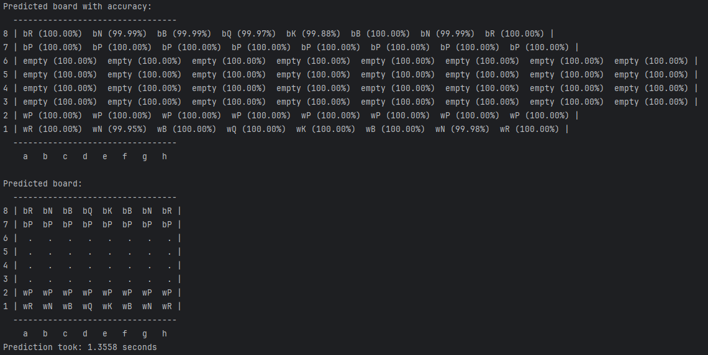

# ♜ Rookception

## 🏆 Project Overview
**Rookception** is a **chessboard recognition and move recommendation system** powered by **deep learning and Stockfish**.
- **Recognize chess pieces** from an image of a chessboard using a **CNN (Convolutional Neural Network)**.
- **Convert the board state to FEN notation** for chess engines.
- **Analyze the position with Stockfish** and return the best move.
- **Provide an API** that accepts a chessboard image and returns the best move to play.

This project serves as the foundation for a fully automated **chess bot** that can analyze and play games.

---

## ⚙️ Project Setup
### **1️⃣ Create & Activate a Virtual Environment**
```powershell
mkdir venv
python -m venv ./venv
.\venv\Scripts\activate.ps1  # Windows (PowerShell)
```

### **2️⃣ Upgrade Pip**
```powershell
python -m pip install --upgrade pip
```

### **3️⃣ Install Dependencies**
```powershell
pip install --upgrade -r requirements.txt
```

## 📡 API Usage
### **Sending a Chessboard Image for Analysis**
### **1️⃣ Example Usage**
```python
import requests

api_url = "http://127.0.0.1:8000/analyze/"
image_path = "path/to/chessboard.png"

response = requests.post(api_url, json={"image_path": image_path})

if response.status_code == 200:
    data = response.json()
    print(f"FEN Notation: {data['fen']}")
    print(f"Best Move: {data['best_move']}")
else:
    print("Error:", response.json())
```

## 🌐 API Endpoints

### **2️⃣ Available Endpoints**
| **Method** | **Endpoint**  | **Description** |
|------------|--------------|-----------------|
| `POST`     | `/analyze/`   | Accepts a chessboard image path and additional FEN-related parameters, then returns the **best move**. |
| `GET`      | `/test/`      | Returns a simple message to verify the API is running. |

---

### **📥 API Request Body (POST `/analyze/`)**
When sending a request to `/analyze/`, you can provide the following parameters:

| **Parameter**        | **Type**   | **Description** |
|----------------------|-----------|-----------------|
| `image_path`        | `string`  | Path to the local chessboard image (optional). |
| `turn`              | `string`  | `'w'` for white, `'b'` for black (optional). |
| `castling_rights`   | `string`  | Castling availability (`"KQkq"` for all rights, `"-"` if none) (default: `"-"`). |
| `en_passant`        | `string`  | En passant target square (e.g., `"e3"` or `"-"`) (default: `"-"`). |
| `halfmove`          | `integer` | Halfmove clock for the fifty-move rule (default: `0`). |
| `fullmove`          | `integer` | Full move number (default: `1`). |

---

### **📤 API Response**
The `POST /analyze/` endpoint returns the best move calculated by **Stockfish** based on the recognized board state.

#### **✅ Example Response**
```json
{
    "best_move": "e2e4"
}
```


## 🔍 Board Recognition & FEN Conversion

### **Converting Board State to FEN**
1. **CNN** predicts each square of the chessboard.
2. The board state is converted to **FEN notation** using a utility function.
3. The **FEN notation** is sent to **Stockfish** to get the best move.

### **Example Output:**
#### **📸 Chessboard Recognition**


#### **🔢 FEN Output**
rnbqkbnr/pppppppp/8/8/8/8/PPPPPPPP/RNBQKBNR w KQkq - 0 1

